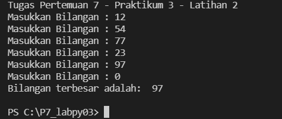

# Tugas Pertemuan 7 - Praktikum 3 - p7_labpy03


Repository ini dibuat untuk memenuhi Tugas Bahasa Pemrograman - Pertemuan 7 - Praktikum 3


Pada pertemuan 7 ini saya diberi tugas oleh Dosen untuk mempelajari dan membuat program sederhana dengan Bahasa Pemrograman Python


Nama      : Bagas Ari Pradana

NIM       : 312110485

Kelas     : TI.21.C.5

# Tugas Latihan 1

* Pada tugas kali ini saya diminta dosen untuk mengerjakan tugas latihan1.py, seperti gambar dibawah ini :


* Saya membuat source code dari perintah diatas (sesuai gambar), seperti dibawah ini :
    ```` Python
    n=int(input("Masukkan Nilai N : "))

    import random

    for x in list(range(1, n+1, 1)):
        print(f"Data ke: {x} ->",random.uniform(0, 0.5))
    ````

Dari source code diatas akan saya jelaskan beberapa syntax atau function nya

* Pada source code pertama, yaitu :
```` python
    import random
````
berfungsi untuk memasukkan function random yang ada didalam bahasa pemrograman python ke program yang telah saya buat.
* Untuk langkah kedua, penjelasan dari source code berikut :
```` python
    for x in list(range(1, n+1, 1)):
        print(f"Data ke: {x} ->",random.uniform(0, 0.5))
````
* Fungsi for disini sebagai bentuk perulangan, selain menggunakan for kita juga bisa menggunakan function while. Untuk kali ini saya menggunakan fungsi for pada program.

Penggunaan syntax default for adalah :

    for index in range(jumlahperulangan):
    perintah_yang_diulang

* Sedangkan untuk function range terdapat syntax default dari Python, seperti berikut :

    range(start, stop, step_size)

    Keterangan :
    start -> Nilai Awal
    stop -> Nilai Akhir
    step_size -> Nilai Kenaikan

* Function list() berfungsi untuk membuat hasil berupa daftar baris.
* Fungsi random.uniform() adalah untuk menampilkan bilangan float random dengan batas awal bilangan, dan batas akhir bilangan.
Pada fungsi ini penulisan syntax random.uniform() harus diisi dengan 2 niai dialam tanda kurung. Yaitu batas awal (Nilai Terendah). 
* Pada program tersebut saya menggunakan isi dalam fungsi range(1, n+1, 1), Artinya : 
    1.Start saya menggunakan angka 1, karena saya ingin saat data dimuat/diproses dimulai dengan angka 1

    2.Stop saya menggunakan n+1, Mengapa ada n? Karena n merupakan variable dari inputan yang user masukkan. Saya menggunakan +1 karena default pada fungsi stop di range adalah nilai itu juga. Misalnya kita memasukkan nilai stop 6, maka ketika angka 6 akan berhenti, jadi yang akan ditampilkan nilai 1-2-3-4-5. Nah angka 6 kan tidak ditampilkan, sedangkan kita menginginkannya menampilkan hasil 1-2-3-4-5-6. Dengan n+1 lah fungsi itu akan berjalan.

Hasil dari program tersebut seperti berikut :
1.Saya ingin memampilkan 5 baris bilangan dengan nilai 0 sampai 0.5
Gambar Latihan 1


2.Saya ingin menampilkan 8 baris bilangan dengan nilai 0 sampai 0.5


# Latihan 2


* Saya membuat source code dari perintah diatas (sesuai gambar), seperti dibawah ini :

```` python
    print("Tugas Pertemuan 7 - Praktikum 3 - Latihan 2")

    xangka=0
    while True:
        xbilangan = int(input("Masukkan Bilangan : "))
        if (xangka < xbilangan):
            xangka=xbilangan
        if (xbilangan == 0):
            break

    print("Bilangan terbesar adalah: ",xangka)
    print()
````
Untuk mengerjakan soal diatas maka kita perlu memasukan atau menginput datanya terlebih dahulu atau setelah itu bisa dilihat data yang akan dijalankan dengan syntax diatas. Dan untuk melihat hasil menjalankan syntx diatas dan kita bisa menginput nilai seperti berikut.



# Selesai